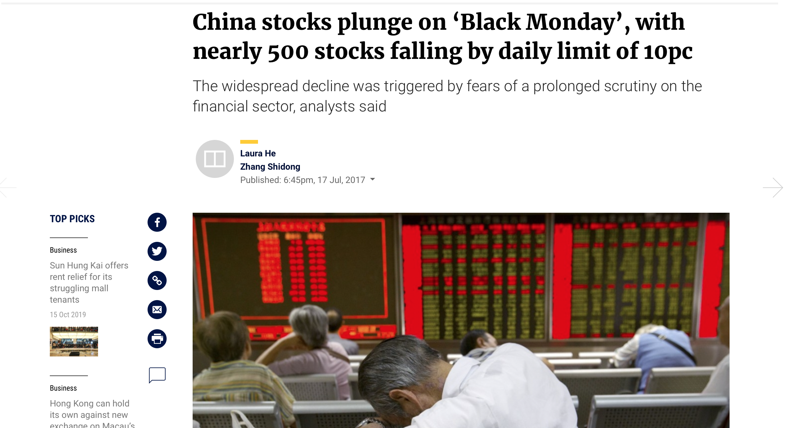
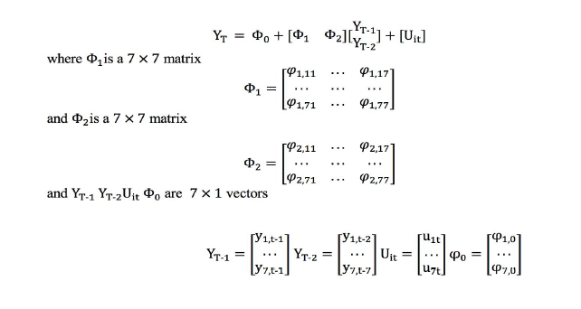
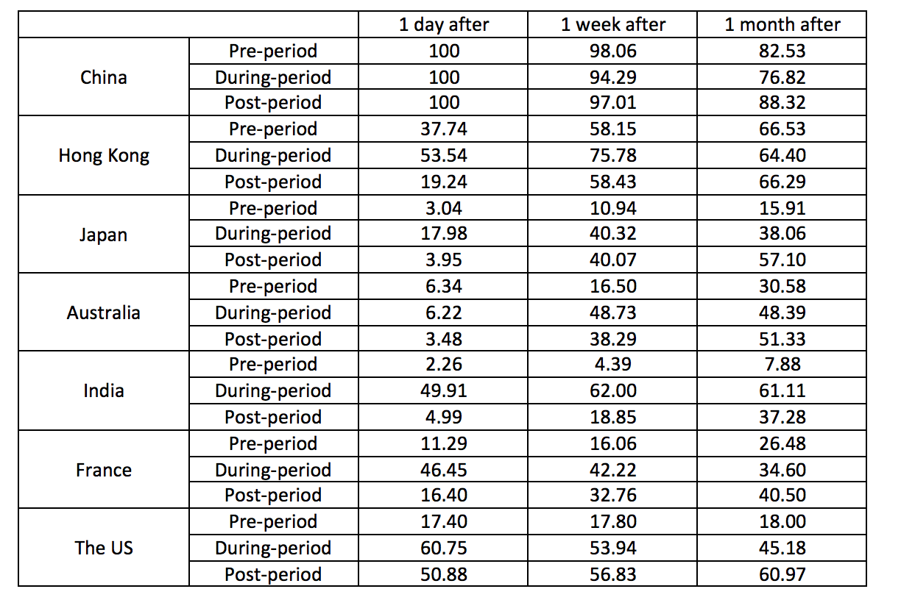
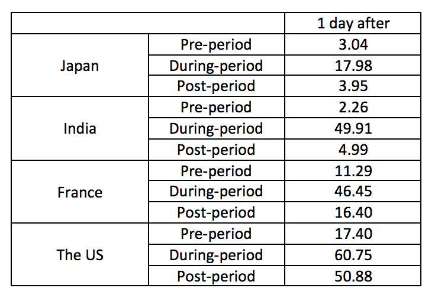
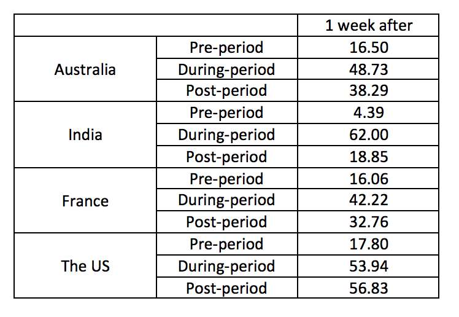

class: center, middle 
```{r setup, include=FALSE}
knitr::opts_chunk$set(echo = FALSE)
library(xaringan)
library(tibble)
library(magrittr)
library(dplyr) 
```

## China's Influence in the Global Financial Market - Volatility Index 

.pull-left[.center[  
]]

.pull-right[
### The research question posed to this end is whether volatility in China has a significant impact on volatility in other markets and whether this impact has been increasing over time. 
]
---
## Contents

### Data
### VAR and Structural VAR
### Granger Causality
### Variance Decompositions 
### Diebold-Yilmaz Spillover Index 
### Discussion
---
## Data 
.center[]

.left[
There is a nascent body of literature documenting the fact that shocks to the onceisolated Chinese stock market are having greater implications for financial markets all over the world.]

---
## Data

```{r,cache=TRUE, message=FALSE, warning = FALSE}
library(tidyverse)
library(formattable)
tribble(
  ~ "Stock Market", ~"Volatility Index",
  "China", "ETF VIX",
  "Hong Kong", "HSIVIX",
    "The US", "S&P500 VIX",
  "Japan","Nikkei VIX",
  "Australia","S&P/ASX 200 VIX",
  "France","CAC 40 VIX",
  "India", "India VIX") %>%
  knitr::kable(format = "html") 

```

---
## Data 

.center[
```{r plot, cache=TRUE, message=FALSE, warning = FALSE,out.width = '700px'}
library(ggplot2)
library(gganimate)
library(tidyr)
library(readxl)
library(gifski)
total<- read_excel("data/total.xlsx")
totallong<- gather(total, country, index,China:India)
totallong$index <- as.numeric(as.character(totallong$index))
g<- ggplot(data=totallong, aes(x = Date, y = index)) + 
  geom_line(aes(color = country))  +
  ylab("index") +
  xlab("Date")  +
  ggtitle("Vix Index Over The Period") +
  geom_vline(xintercept = as.POSIXct("2015-06-01"), linetype=4)+
  geom_vline(xintercept = as.POSIXct("2016-06-01"), linetype=4)+ 
  transition_reveal(Date) 
animate(g, height = 600, width =1000)
```
] 
.left[
- First Period: 1 June 2013 to 29 May 2015
- Second Period: 1 June 2015 to 30 June 2016
- Thrid Period: 1 July 2016 tp 29 June 2018]
---
## VAR and Structural VAR

.center[]


.left[
- The variables used in this VAR are volatility indices for seven different financial markets. A seven-variate VAR is estimated for each period and the lag length is chosen according to the Hannan-Quinn information Criteria.
- In the periods before and after the stock market crash the optimal lag length is 2 and during the crash period, the optimal lag is 1.
]

---
## VAR and Structural VAR

```{r,cache=TRUE, message=FALSE, warning = FALSE}
tribble(
  ~ "Stock Market", ~"Running Hour of the Stock Market in (UTC)",
  "China", "1:30-7:00",
  "Hong Kong", "1:30-8:00",
  "Japan","0:00-6:00",
  "Australia","0:00-6:00",
  "India","3:45-10:00",
  "France", "8:00-16:30",
  "The US", "14:30-21:00"
) %>%
  knitr::kable(format = "html")
```
  
.left[
#### The Cholesky ordering is based on the open time for the relevant stock markets. Since the influence of the Chinese financial market is being investigated, the Chinese volatility index will be put first.
]
---
## Granger Causality
.pull-left[ 
.left[
- Granger Causality Test:  
H0: There is no granger causality from y1 to y2  
H1: There is evidence of granger causality   
- Exogeneity Test:  
H0: y1 is exogenous   
H1: yi is endogenous   ]]

.pull-right[ 
```{r,cache=TRUE, message=FALSE, warning = FALSE}
 tribble(
  ~ "Stock Market", ~"Pre",~"During",~"Post",
  "Hong Kong", 0.0006,0.0086,0.029,
  "Japan",0.0604,0.3039,0.0063,
  "Australia",0.0404,0.0271,0.1996,
  "India",0.1974,0.0218,0.0001,
  "France", 0.1220,0.4176, 0.2620,
  "The US", 0.4692,0.9802,0.2276
) %>%
  knitr::kable(format = "html")
```
]

---
## Variance Decompositions 

.center[]
---
## Variance Decompositions 
### Immediate Effect - After 1 Day

.pull-left[
- For Japan, about 18% variation due to the variation in China’s stock market in during-period, and only 3% in pre-period. 
- For India, France, and The US, there are large increases in their variation that is due to the variation in the Chinese stock market in During-crash period comparing to the pre-crash period. 
]

.pull-right[]
---
## Variance Decompositions 
### Short Term Effect - After 1 Week 
.pull-left[ 
- In general there is a large spike in the percentage variance in forecasted volatility in each stock market that is due to the variance in china’s stock market in the during period. 
- In period after crash, these percentages fall to a level but they still higher than that in the pre-crash period. 
]

.pull-right[]
---
## Diebold-Yilmaz Spillover Index 
```{r}
tribble(
  ~ " ", ~"H=1(one day after shock) ", ~"H=5(one week after shock) ", ~"H=25(one month after shock) ",
  "pre-crisis", 0.16691, 0.27544, 0.40123,   
  "during-crisis", 0.40064, 0.58175, 0.67241,
  "post-crisis", 0.19097, 0.43093, 0.56084) %>%
  knitr::kable(format = "html")
```

.left[
- Firstly, it seems that over longer forecast horizons volatility spillover between financial markets increases.   
- Secondly, there is a higher degree of volatility spillover between the markets considered during the period covered by China’s stock market crash.   
- While the degree of volatility spillover between markets falls in post-crash period relative to the period covered by the crash, it increases relative to the period prior to the crash. ]
---
## Discussion
.center[
```{r plot2, cache=TRUE, message=FALSE, warning = FALSE,out.width = '700px'}
library(ggplot2)
library(gganimate)
library(tidyr)
library(readxl)
library(gifski)
total<- read_excel("data/total.xlsx")
totallong<- gather(total, country, index,China:India)
totallong$index <- as.numeric(as.character(totallong$index))
g<- ggplot(data=totallong, aes(x = Date, y = index)) + 
  geom_line(aes(color = country))  +
  ylab("index") +
  xlab("Date")  +
  ggtitle("Vix Index Over The Period") +
  geom_vline(xintercept = as.POSIXct("2015-06-01"), linetype=4)+
  geom_vline(xintercept = as.POSIXct("2016-06-01"), linetype=4)+ 
  transition_reveal(Date) 
animate(g, height = 600, width =1000)
```
]

---